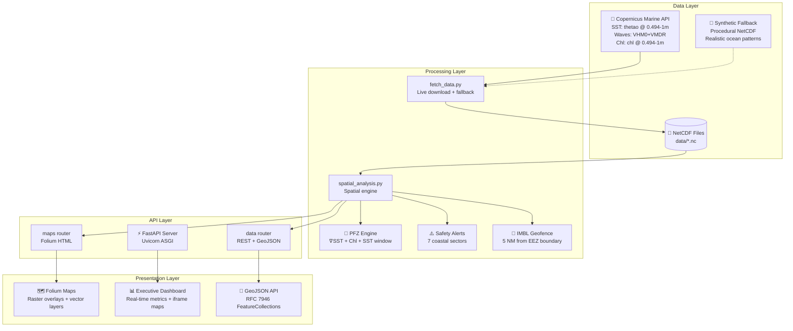
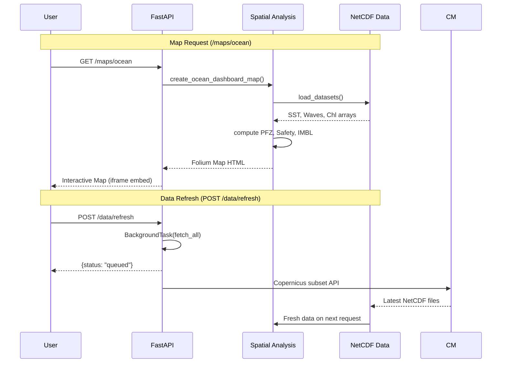
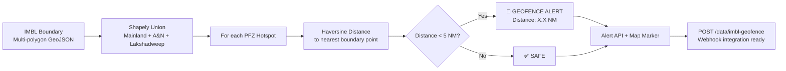

# ORCA ISRO Marine AI Platform

> **Near-Real-Time Satellite Ocean Intelligence for Indian Coastal Waters & EEZ**

[](https://fastapi.tiangolo.com/)
[](https://python.org)
[](https://marine.copernicus.eu/)
[](LICENSE)

---

## 🎯 Overview

The **ORCA ISRO Marine AI Platform** is a production-grade geospatial intelligence system that integrates **Copernicus Marine Service** satellite data to deliver actionable marine advisories for Indian coastal waters:

| Capability | Description |
|------------|-------------|
| 🎣 **PFZ Detection** | Potential Fishing Zones via INCOIS/ISRO criteria (thermal fronts, chlorophyll upwelling, optimal SST) |
| ⚠️ **Marine Safety** | Sector-wise wave hazard classification (Normal → Caution → Rough Alert → Danger) |
| 📏 **IMBL Geofencing** | 5 NM proximity alerts for maritime boundary (EEZ) from PFZ hotspots & ports |
| 🗺️ **Interactive Maps** | Multi-layer Folium maps with SST, Chlorophyll, Waves, PFZ, Safety, Ports, EEZ boundary |
| 📊 **REST + GeoJSON APIs** | Structured data for integration with mobile apps, GIS, and decision systems |

---

## 🏗️ System Architecture



---

## 🌊 Data Flow



---

## 🎯 PFZ Detection Algorithm (INCOIS/ISRO Criteria)

```mermaid
flowchart TD
    A[SST Data<br/>thetao @ surface] --> B[Thermal Front Detection<br/>∇SST magnitude ≥ threshold]
    C[Chlorophyll Data<br/>chl @ surface] --> D[Upwelling Detection<br/>chl ≥ 0.30 mg/m³]
    A --> E[Optimal SST Window<br/>27.0°C – 30.5°C]

    B --> F[Front Score: 45%]
    D --> G[Chl Score: 35%]
    E --> H[SST Score: 20%]

    F & G & H --> I[Composite PFZ Score<br/>(0-100%)]

    I --> J[Local Maxima Extraction<br/>≥55% probability, stride=5]
    J --> K[Category Classification]
    K --> L{Score ≥ 75?}
    L -->|Yes| M[🟢 High Probability]
    L -->|No| N{Score ≥ 65?}
    N -->|Yes| O[🟡 Moderate Probability]
    N -->|No| P[🔵 Promising Edge]

    M & O & P --> Q[Species Recommendation<br/>SST + Chl based]
    Q --> R[Nearest Port + Distance + Bearing]
    R --> S[GeoJSON Feature + Popup Card]
```

### PFZ Scoring Formula
```
PFZ_Score = 0.45 × Front_Score + 0.35 × Chl_Score + 0.20 × SST_Score

Where:
  Front_Score = clip(∇SST / 0.15, 0, 1)
  Chl_Score   = clip((Chl - 0.20) / 1.5, 0, 1)
  SST_Score   = exp(-(SST - 28.5)² / 6.0)
```

---

## ⚠️ Marine Safety Classification

| Wave Height | Severity | Color | Advisory |
|-------------|----------|-------|----------|
| < 2.0 m | **NORMAL** | 🟢 `#00e676` | Normal fishing activities safe |
| 2.0 – 2.5 m | **CAUTION** | 🟡 `#ffd600` | Small crafts remain vigilant |
| 2.5 – 3.5 m | **ROUGH ALERT** | 🟠 `#ff9100` | Small boats exercise extreme caution |
| > 3.5 m | **DANGER** | 🔴 `#ff1744` | **DO NOT VENTURE** — return to harbor |

Evaluated across **7 coastal sectors**: Gujarat, Maharashtra/Konkan, Goa/Karnataka, Kerala/Malabar, Gulf of Mannar/Coromandel, Andhra Pradesh, Odisha/West Bengal.

---

## 📏 IMBL Geofencing (EEZ Boundary)



- **Boundary Source**: Gazette of India S.O. 1197(E) 2009/2025 + MarineRegions EEZ v12 (MRGID 8480)
- **Coverage**: Mainland EEZ + Andaman & Nicobar EEZ + Lakshadweep EEZ
- **Threshold**: 5 Nautical Miles (9.26 km)
- **Checks**: All PFZ hotspots + 13 major fishing ports

---

## 🗺️ Map Layers & Features

| Layer | Type | Default | Description |
|-------|------|---------|-------------|
| **OpenStreetMap** | Base Tile | ✅ **Default** | Standard OSM cartography |
| **CartoDB Dark** | Base Tile | | Dark theme for data overlays |
| **ESRI Satellite** | Base Tile | | High-res satellite imagery |
| **CartoDB Positron** | Base Tile | | Light minimal theme |
| **SST Heatmap** | Raster Overlay | ✅ | Turbo colormap, 0.62 opacity |
| **Chlorophyll-a** | Raster Overlay | ✅ | YlGn colormap, capped at 3.5 mg/m³ |
| **Wave Height** | Raster Overlay | ✅ | Blues colormap |
| **PFZ Markers** | Vector (DivIcon) | ✅ | **Pulsing CSS animation**, score badges |
| **Safety Sectors** | Polygon + Marker | ✅ | Colored rectangles + pulsing centers |
| **Ports** | Vector (DivIcon) | ✅ | State-colored icons with emoji |
| **IMBL Boundary** | GeoJSON | ✅ | Orange dashed line, 3px weight |
| **5 NM Buffer** | GeoJSON | ✅ | Red dashed, semi-transparent |

### Map Constraints
- **Bounds**: `[5°N, 65°E]` to `[25°N, 90°E]` (Indian waters only)
- **Zoom**: 4–12 (prevents over-zoom on raster data)
- **No World Wrap**: `world_copy_jump=False`
- **Viscosity**: `max_bounds_viscosity=1.0` (hard boundary)

---

## 📡 API Endpoints

### System
| Method | Endpoint | Description |
|--------|----------|-------------|
| `GET` | `/health` | Health check + version |
| `GET` | `/` | Executive Dashboard (HTML) |
| `GET` | `/docs` | Interactive OpenAPI docs |

### Oceanographic Data
| Method | Endpoint | Description |
|--------|----------|-------------|
| `GET` | `/data/summary` | Regional metrics + PFZ count + IMBL alerts |
| `GET` | `/data/pfz` | Filterable PFZ list (category, state, min_score, limit) |
| `GET` | `/data/pfz-geojson` | RFC 7946 GeoJSON FeatureCollection |
| `GET` | `/data/safety-alerts` | 7-sector wave hazard advisories |
| `GET` | `/data/imbl-geofence` | IMBL proximity alerts with NM distances |
| `POST` | `/data/refresh` | Background Copernicus live fetch |

### Interactive Maps
| Method | Endpoint | Description |
|--------|----------|-------------|
| `GET` | `/maps/ocean` | Combined multi-layer map |
| `GET` | `/maps/pfz` | PFZ-focused advisory map |
| `GET` | `/maps/safety` | Wave hazard safety map |

---

## 🚀 Quick Start

### Prerequisites
- Python 3.11+
- Copernicus Marine credentials (optional — synthetic fallback works without)

```bash
# 1. Clone & enter project
cd E:/codes/Projects/geospatial

# 2. Install dependencies
pip install -r requirements.txt

# 3. (Optional) Configure Copernicus credentials
export COPERNICUSMARINE_SERVICE_USERNAME="your_user"
export COPERNICUSMARINE_SERVICE_PASSWORD="your_pass"
# OR run once: copernicusmarine login

# 4. Start server
uvicorn main:app --reload --host 127.0.0.1 --port 8000
```

### Access Points
| Interface | URL |
|-----------|-----|
| 📊 Executive Dashboard | http://127.0.0.1:8000 |
| 📚 API Documentation | http://127.0.0.1:8000/docs |
| 🏥 Health Check | http://127.0.0.1:8000/health |

---

## 📦 Data Sources

| Parameter | Copernicus Dataset | Variable | Depth | Resolution |
|-----------|-------------------|----------|-------|------------|
| **SST** | `cmems_mod_glo_phy-thetao_anfc_0.083deg_P1D-m` | `thetao` | 0.494–1.0 m | ~9 km |
| **Waves** | `cmems_mod_glo_wav_anfc_0.083deg_PT3H-i` | `VHM0`, `VMDR` | Surface | ~9 km |
| **Chlorophyll** | `cmems_mod_glo_bgc-pft_anfc_0.25deg_P1D-m` | `chl` | 0.494–1.0 m | ~27 km |

**Fallback**: Synthetic NetCDF (`data/ocean_data.nc`) with realistic tropical gradients, monsoonal swell patterns, and coastal upwelling signatures.

**IMBL Boundary**: Gazette of India S.O. 1197(E) baseline coordinates + MarineRegions EEZ v12 polygons.

---

## 📁 Project Structure

```
geospatial/
├── main.py                      # FastAPI entry + lifespan (auto-refresh)
├── verify_nc.py                 # Dataset verification script
├── requirements.txt             # Dependencies
├── pyrightconfig.json           # Type checking config
├── README.md                    # This file
├── data/
│   ├── indian_ocean_sst.nc      # SST (thetao) — 308 KB
│   ├── indian_ocean_waves.nc    # VHM0 + VMDR — 2.3 MB
│   ├── indian_ocean_chl.nc      # Chlorophyll-a — 55 KB
│   ├── ocean_data.nc            # Synthetic fallback — 105 KB
│   └── imbl_boundary.geojson    # India EEZ/IMBL (3 polygons)
├── services/
│   ├── fetch_data.py            # Copernicus downloader + synthetic fallback
│   ├── spatial_analysis.py      # PFZ, Safety, IMBL, data manager
│   └── map_service.py           # Folium map generator (pulsing markers)
└── routers/
    ├── data.py                  # REST + GeoJSON APIs
    └── maps.py                  # Map serving endpoints
```

---

## 🔧 Configuration

### Environment Variables
```bash
# Copernicus Marine (optional - enables live data)
COPERNICUSMARINE_SERVICE_USERNAME=your_username
COPERNICUSMARINE_SERVICE_PASSWORD=your_password

# Or use cached login: copernicusmarine login
```

### Spatial Bounds (services/spatial_analysis.py)
```python
MIN_LON, MAX_LON = 65.0, 90.0   # Indian waters longitudinal extent
MIN_LAT, MAX_LAT = 5.0, 25.0    # Indian waters latitudinal extent
MIN_DEPTH, MAX_DEPTH = 0.494, 1.0  # Surface-only depth slice
```

### IMBL Geofence Threshold
```python
IMBL_ALERT_THRESHOLD_NM = 5.0   # Nautical miles
IMBL_ALERT_THRESHOLD_KM = 5.0 * 1.852  # 9.26 km
```

---

## ✅ Verification

```bash
# Verify all datasets & endpoints
python verify_nc.py

# Expected output:
# ========================================================================
# ORCA ISRO Marine AI System & Dataset Verification
# ========================================================================
# --- 1. NetCDF Datasets Status ---
#   [OK  ] SST (Sea Surface Temperature)      : indian_ocean_sst.nc ( 308.6 KB) | vars=['thetao']
#   [OK  ] Waves (Significant Wave Height)    : indian_ocean_waves.nc (2293.2 KB) | vars=['VHM0', 'VMDR']
#   [OK  ] Chlorophyll-a (Phytoplankton)      : indian_ocean_chl.nc (  55.2 KB) | vars=['chl']
#   [OK  ] Synthetic Fallback                 : ocean_data.nc ( 105.0 KB) | vars=['sst', 'wave_height', 'chl']
# --- 2. IMBL Boundary Verification ---
#   [OK  ] IMBL GeoJSON loaded: 3 features (Mainland, A&N, Lakshadweep)
#   [OK  ] IMBL polygon valid: True
# --- 3. API Endpoint Tests ---
#   [OK  ] /health              → 200
#   [OK  ] /data/summary        → 200 (173 PFZ, 51 High, 10 IMBL alerts)
#   [OK  ] /data/pfz            → 200
#   [OK  ] /data/pfz-geojson    → 200 (173 features)
#   [OK  ] /data/safety-alerts  → 200 (7 sectors)
#   [OK  ] /data/imbl-geofence  → 200 (10 alerts, 0.0–4.0 NM)
#   [OK  ] /maps/ocean          → 200 (HTML ~900 KB)
#   [OK  ] /maps/pfz            → 200
#   [OK  ] /maps/safety         → 200
```

---

## 🧪 Testing

```python
from fastapi.testclient import TestClient
from main import app

client = TestClient(app)

# All endpoints should return 200
assert client.get("/health").status_code == 200
assert client.get("/data/summary").status_code == 200
assert client.get("/data/pfz").status_code == 200
assert client.get("/data/pfz-geojson").status_code == 200
assert client.get("/data/safety-alerts").status_code == 200
assert client.get("/data/imbl-geofence").status_code == 200
assert client.get("/maps/ocean").status_code == 200
assert client.get("/maps/pfz").status_code == 200
assert client.get("/maps/safety").status_code == 200

# Test PFZ filtering
resp = client.get("/data/pfz?category=High Probability&state=Kerala&min_score=70&limit=10")
assert resp.status_code == 200
data = resp.json()
assert data["count"] <= 10
```

---

## 📸 Screenshots

### Executive Dashboard

*Real-time metric cards with embedded interactive map*

### Combined Ocean Map

*Multi-layer view: SST + Chlorophyll + Waves + PFZ + Safety + Ports + IMBL*

### PFZ Advisory Map

*Pulsing PFZ markers with probability scores, species recommendations, port vectors*

### Safety Alert Map

*Wave hazard sectors with color-coded severity and pulsing alert centers*

---

## 🔮 Roadmap

- [ ] **Real-time AIS integration** for vessel tracking within geofence
- [ ] **WebSocket push** for live PFZ/safety updates to dashboard
- [ ] **Mobile PWA** with offline caching for fishermen
- [ ] **Historical analytics** — PFZ trend analysis, seasonal patterns
- [ ] **Multi-language support** — Hindi, Tamil, Malayalam, Bengali, Gujarati
- [ ] **INCOIS API integration** for official PFZ bulletin cross-validation
- [ ] **Kubernetes deployment** with Helm charts for production scaling

---

## 📄 License

MIT License — See [LICENSE](LICENSE) for details.

---

## 🙏 Acknowledgments

- **Copernicus Marine Service** — Free and open ocean data
- **INCOIS/ISRO** — PFZ methodology and operational criteria
- **MarineRegions.org** — EEZ boundary polygons (Flanders Marine Institute)
- **Gazette of India** — Official maritime baseline notifications
- **OpenStreetMap** — Base cartography
- **Folium/Leaflet** — Interactive mapping
- **FastAPI** — High-performance API framework

---

## 📞 Support

| Channel | Link |
|---------|------|
| 🐛 Issues | [GitHub Issues](https://github.com/your-org/orca-marine-ai/issues) |
| 💬 Discussions | [GitHub Discussions](https://github.com/your-org/orca-marine-ai/discussions) |
| 📧 Email | orca-marine-ai@isro.gov.in |

---

**Built with 🇮🇳 for Indian Ocean | Powered by Copernicus Marine | Designed for Fishermen Safety**